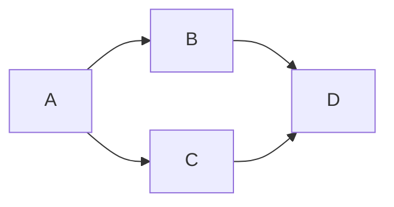

# DBT Example

## Status

**Working.**

## Description

What is this pipeline?



## Quickstart

First run `docker compose up` to create a postgres db.

To make a venv for dbt:

```shell
python3 -m venv dbt-env
source dbt-env/bin/activate
dbt-env/bin/pip install dbt-postgres
```

To generate data and run dbt:

```shell
cd seeds && jafgen --years 1  && cd .. # Generate data.
dbt seed --profiles-dir . # Runs seeding.
dbt test --profiles-dir . # Runs tests.
dbt debug --profiles-dir . # Checks configs.
dbt run --profiles-dir . # Runs model creation, etc.

dbt docs generate
dbt docs serve --port 8001
```
