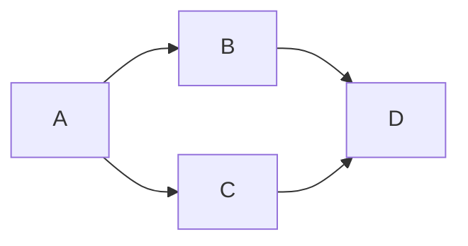

# MLFlow

## Last Updated

2023-11-22

## Status

**Not Working.**

If not working:

- [x] In progress

## Description

[MLflow](https://github.com/mlflow/mlflow/pkgs/container/mlflow) is a platform to streamline machine learning development, including tracking experiments, packaging code into reproducible runs, and sharing and deploying models. MLflow offers a set of lightweight APIs that can be used with any existing machine learning application or library (TensorFlow, PyTorch, XGBoost, etc), wherever you currently run ML code (e.g. in notebooks, standalone applications or the cloud).

## Quickstart

How do I run this?

## Credentials

|          |            |
| -------- | ---------- |
| User     | `user`     |
| Password | `password` |

## Notes

## Resources
