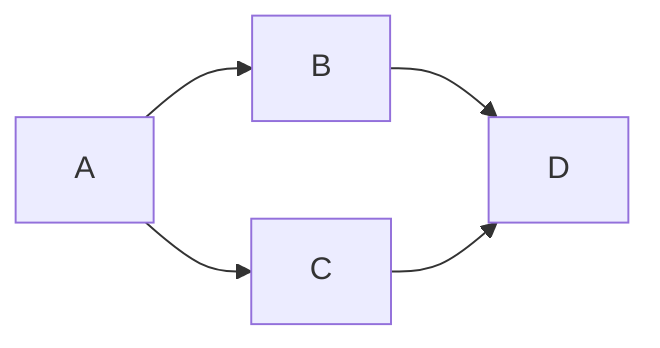

# tailwind

## Last Updated

2024-06-27

## Status

**Not Working.**

If not working:

- [ ] Error

- [ ] In progress

## Description

What is this pipeline?

## Quickstart

How do I run this?

## Credentials

|          |            |
| -------- | ---------- |
| User     | `user`     |
| Password | `password` |

## Notes

## Resources
