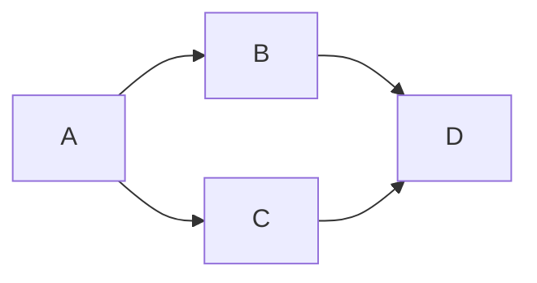

# Iceberg on S3 Data Lakehouse

## Status

**Not Working.**

If not working:

- [ ] Error

- [x] In progress

## Description

What is this pipeline?



## Quickstart

To run:

```shell
just run
```

To clean up:

```shell
just clean
```

## Credentials

|          |            |
| -------- | ---------- |
| User     | `user`     |
| Password | `password` |

## Notes
