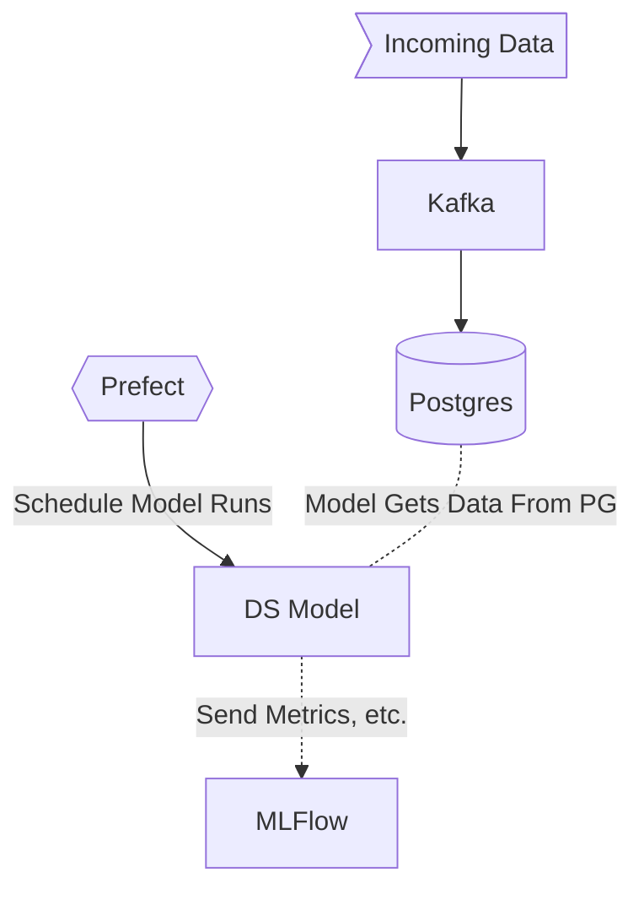

# Kafka-Prefect-Postgres Pipeline

## Description

Requires the user to have **ssh://git@github.com/jsal13/toys** cloned and at some location which I will refer to as `$TOYS_HOME`.

### Architecture



## Quickstart

**To run**:

```shell
just run
```

**To clean up**:

```shell
just clean
```

## Notes

- Remember to start a work-pool and agent.
  - For example, for work-pool `test` you can start an agent in the following way:

  ```shell
  prefect work-pool create test-pool
  prefect agent start -p 'test-pool'
  ```
