# Pipeline Name Here

## Last Updated

2023-11-18

## Status

**Not Working.**

If not working:
- [ ] Error
- [x] In progress

## Description

[Prometheus](https://github.com/prometheus/prometheus) is a systems and service monitoring system.  This toy gives a few examples of what it can monitor:

- Itself (Prometheus logs)

TODO: This is not quite accurate.

```mermaid
graph TD
    A(Grafana):::grafana
    B(Prometheus):::prometheus
    C(PYTHON_API):::python_api
    D(DB):::postgres

    classDef prometheus fill:#660033;
    classDef grafana fill:#006633;
    classDef python_api fill:#994400;
    classDef postgres fill:#003366;

    B---|Pings the <br/>/metrics endpoint|C;
    A---|Connects to|B;
    A---|Connects to|D;
```



## Quickstart

```shell
docker compose \
    -f compose.yaml \
    -f ./example_api/compose.yaml \
    up

# To tear down
docker compose down --volumes
```

### Sample Queries

```text
rate(http_request_size_bytes_count[20s])
```

## Credentials

## Notes

## Resources

## TODO

- Get example queries.
- Get more things to monitor.
- Grafana?  Or maybe in another toy.
- Trino?