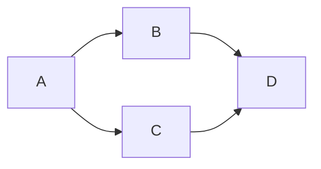

# Kafka to Postgres Pipeline

## Status

**Not Working.**

If not working:

- [ ] Error

- [x] In progress

## Description

What is this pipeline?



## Quickstart

## Credentials

## Notes

### Useful Commands

While on the host machine (not in any docker container) while docker compose is up:

```shell
curl http://localhost:8083/connector-plugins | jq '.[].class' # Gets all installed connectors.
curl http://localhost:8083/connectors | jq # Active connectors.
curl -X POST http://localhost:8083/connectors -d "@datagen-orders-config.json" -H "Content-Type: application/json" # Installs the associated connector.
curl http://localhost:8083/connectors/datagen-orders/status  # Get connector status.
curl -X PUT http://localhost:8083/connectors/datagen-orders/pause
curl -X PUT http://localhost:8083/connectors/datagen-orders/resume
curl -X DELETE http://localhost:8083/connectors/datagen-orders
```

While exec'd into the Kafka broker:

```shell
# Test console consumer...
kafka-console-consumer --bootstrap-server localhost:9092 \
    --topic orders_json --property print.key=true

# With a proper avro schema...
kafka-avro-console-consumer --bootstrap-server localhost:9092 --topic commercials_avro \
     --property schema.registry.url=http://localhost:8081
```

## References

- [Kafka Connect Datagen Dockerhub](https://hub.docker.com/r/cnfldemos/kafka-connect-datagen)
- <https://github.com/confluentinc/avro-random-generator#schema-annotations>
- <https://hub.docker.com/r/debezium/postgres>
- <https://medium.com/high-alpha/data-stream-processing-for-newbies-with-kafka-ksql-and-postgres-c30309cfaaf8>
